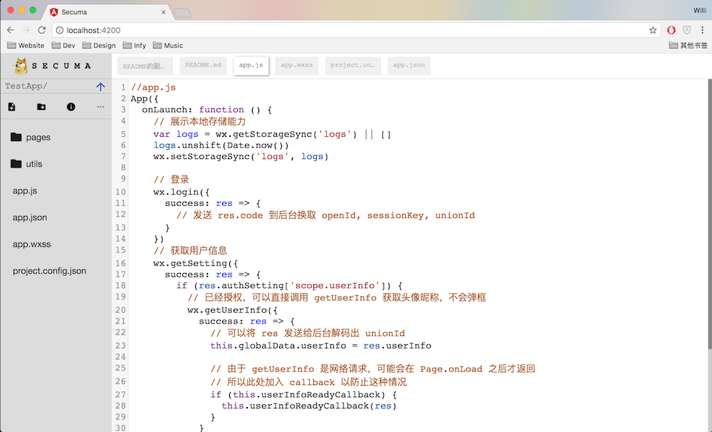

# SECURIY
Online editor, could deploy on any NODEJS based sites, to modify your code/file remotely.

### Configure & Run
`npm install` in both `angular/` and root.
- `npm run start` in root to start nodejs server
- `npm run start` in `angular/` to start angular watch server
- open browser and check `http://localhost:4200`

### v0.8 - Current
Main feature completed.